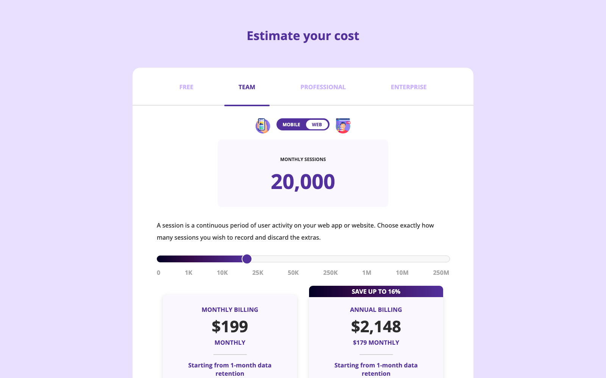
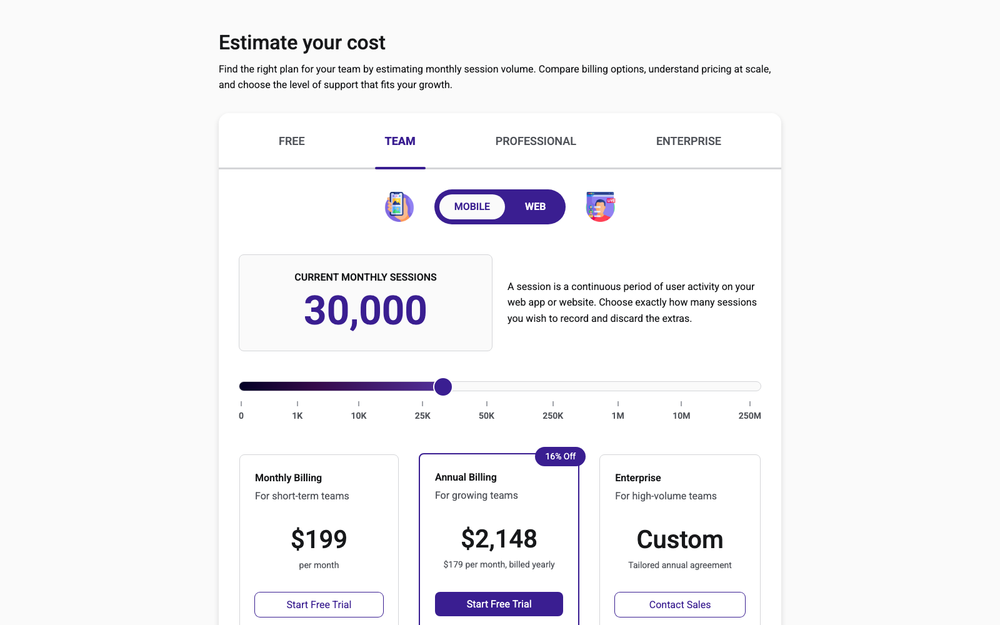

# Exercise 28 — Cost Estimator (course-improved project)

[Live demo](https://vigneshsrinivasan-sys.github.io/exercise-28-cost-estimator/) · [Improved HTML source](index.html) · [Improved CSS source](styles.css) · [Original HTML](original/index.html) · [Original CSS](original/styles.css)

## Before and after

### Before — Colt Steele’s course version

### After — My version extends the course exercise with an expanded HTML/CSS interface.

## Why this exercise exists

This is an independent practice project completed while working through Colt Steele’s *The HTML & CSS Bootcamp*. The course provides the ordered learning content; I use each exercise to reinforce the concept until it is understood, then apply it in a concrete interface and push beyond the minimum lesson where appropriate. Together, these projects document a deliberate progression toward stronger design-to-code fluency as a Product Designer.

For this course-improved build, Colt’s Cost Estimator is the starting point. My version applies a personally established design-system approach to the same core idea, using clearer product content, stronger hierarchy, and a more complete pricing-estimation interface.

## Focus

**Primary practice:** extending a course UI into a more coherent product interface through reusable HTML/CSS patterns

- Semantic grouping for the estimator, plan navigation, session scale, and pricing-card regions
- Design-system roles, tokens, utilities, and component variants using the project’s `ds-`, `u-`, and `c-` naming conventions
- CSS layout with flexbox and grid, including aligned pricing cards and responsive wrapping
- Styled radio controls, selected states, badges, borders, hover states, and typography hierarchy
- Content and interaction framing for a product-pricing experience rather than a bare lesson demo

## What I built

The improved version organizes the page as a product estimator: plan navigation, platform selection, session-volume context, a visual scale, and three differentiated pricing cards. The page uses the same underlying learning exercise while making the hierarchy, visual language, and reusable styling decisions easier to inspect.

## Implementation notes

- The live demo and root source files are my improved version. Colt’s original source is retained under [`original/`](original/) for direct comparison.
- The estimator controls and calls to action are presentational HTML/CSS elements; this repository does not add a JavaScript calculation engine.
- The preview images are rendered snapshots of the two implementations. The live demo shows the improved page itself.
- Typography and icons use the external Google Fonts and Font Awesome resources referenced by the source.

## Sequence

**Exercise 28** · Course-improved project · HTML & CSS Bootcamp Section 22
